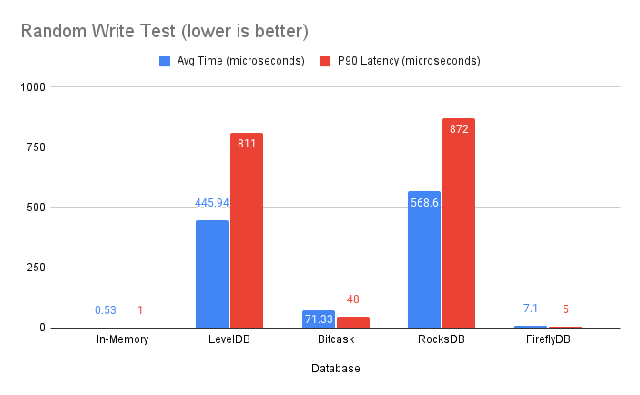
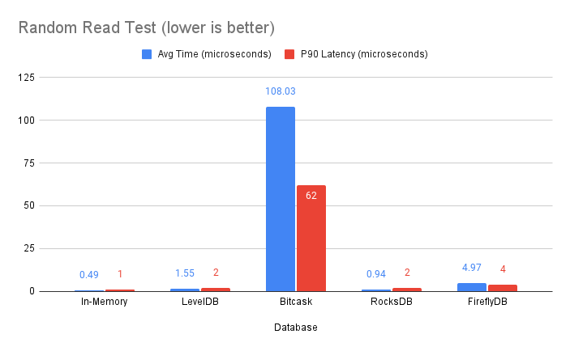
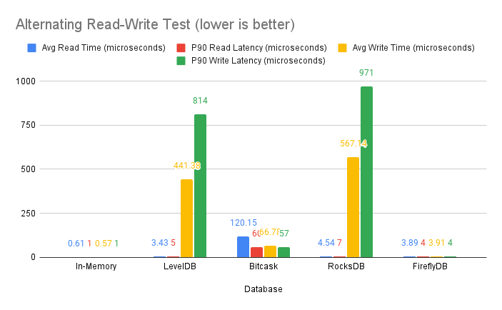

# FireflyDB

FireflyDB is a fast, thread-safe, JVM-based key-value storage engine with microsecond latency. FireflyDB is 20x faster
for reads and 10x faster for writes than [Bitcask](https://github.com/basho/bitcask), which has a similar architecture.

FireflyDB is hash-based and gives up range queries to achieve high throughput and low latency. As a result, it is about
100x faster at writes than [LevelDB](https://github.com/google/leveldb) (Google)
and [RocksDB](https://github.com/facebook/rocksdb) (Facebook).

FireflyDB relies on sensible defaults and does not expose many configuration options. FireflyDB is designed with
educated tradeoffs to achieve high performance:

1. All the keys must fit in memory. This is a tradeoff with all hash-based storage engines. Even with the largest key
   size of 32KB, FireflyDB can store 32,000+ keys per 1GB of memory.
2. FireflyDB does not support range queries.
3. Maximum key size is 32768 bytes or 32KB.
4. Maximum value size is 2,147,483,647 bytes or 2.14 GB.

## Installation

### Maven

```xml

<dependency>
    <groupId>com.sahilbondre</groupId>
    <artifactId>fireflydb</artifactId>
    <version>0.1.1</version>
</dependency>
```

### Gradle

```gradle
implementation 'com.sahilbondre:fireflydb:0.1.1'
```

## API

```java
FireflyDB fireflyDB=FireflyDB.getInstance("path/to/db");
    fireflyDB.start();

// Write
    byte[]key="testKey".getBytes();
    byte[]value="testValue".getBytes();

    fireflyDB.put(key,value);

// Read
    byte[]result=fireflyDB.get(key);

// Compaction 
// FireflyDB will compact automatically but can be triggered on demand.
    fireflyDB.compact();

    fireflyDB.stop();
```

## Benchmarks

```
iterations: 100,000
cpu: 1
memory: 1GB
key-size: 8 bytes
value-size: 100 bytes
```

### Random Write Test

Test: Generate a random key and value and write it to the database.



| Database  | Avg Time (microseconds) | P90 Latency (microseconds) |
|-----------|-------------------------|----------------------------|
| In-Memory | 0.53                    | 1                          |
| LevelDB   | 445.94                  | 811                        |
| Bitcask   | 71.33                   | 48                         |
| RocksDB   | 568.60                  | 872                        |
| FireflyDB | 7.10                    | 5                          |

### Random Read Test

Test: Pick a random key from the ones written in the previous test and read it from the database.



| Database  | Avg Time (microseconds) | P90 Latency (microseconds) |
|-----------|-------------------------|----------------------------|
| In-Memory | 0.49                    | 1                          |
| LevelDB   | 1.55                    | 2                          |
| Bitcask   | 108.03                  | 62                         |
| RocksDB   | 0.94                    | 2                          |
| FireflyDB | 4.97                    | 4                          |

### Alternating Read-Write Test

Test: Perform a read and write operation alternately.



| Database          | Avg Time (microseconds) | P90 Latency (microseconds) |
|-------------------|-------------------------|----------------------------|
| In-Memory (read)  | 0.61                    | 1                          |
| In-Memory (write) | 0.57                    | 1                          |
| LevelDB (read)    | 3.43                    | 5                          |
| LevelDB (write)   | 441.38                  | 814                        |
| Bitcask (read)    | 120.15                  | 60                         |
| Bitcask (write)   | 66.78                   | 57                         |
| RocksDB (read)    | 4.54                    | 7                          |
| RocksDB (write)   | 567.14                  | 971                        |
| FireflyDB (read)  | 3.89                    | 4                          |
| FireflyDB (write) | 3.91                    | 4                          |

## Potential Improvements

- [ ] Add an explicit delete operation.
- [ ] Expose compaction size as a configuration option.
- [ ] Expose compaction interval as a configuration option.
- [ ] Allow larger key size as a configuration option.
- [ ] Expose read only mode.

## Contributing

Pull requests are welcome. For major changes, please open an issue first
to discuss what you would like to change.

Please make sure to update tests as appropriate.

## License

[Apache 2.0](https://raw.githubusercontent.com/godcrampy/fireflydb/master/LICENSE)
